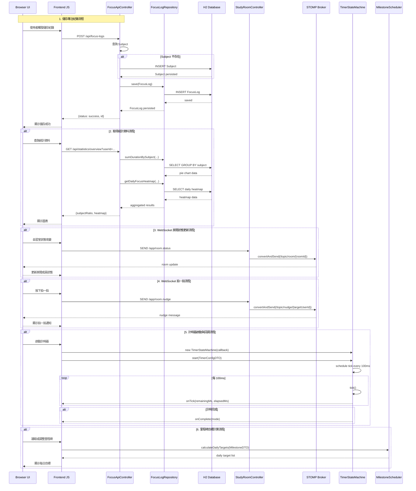
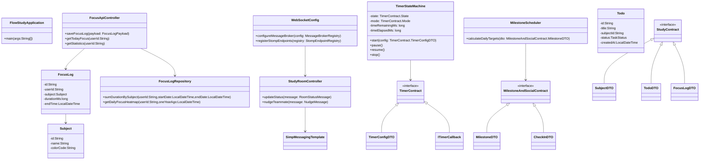

# FlowStudy UML 與 Workflow

本文件說明 FlowStudy 專案的系統元件、資料流與核心序列流程。

> Mermaid 圖可在 VS Code Mermaid preview、GitHub README 或其他支援 Mermaid 的編輯器中直接渲染。

---

## 1. Component Workflow Diagram

```mermaid
flowchart TD
    Browser[Browser UI<br/>(index.html + JS)]
    Static[Static Resources<br/>(HTML/CSS/JS)]
    API[REST API Layer<br/>(/api/*)]
    WS[WebSocket Layer<br/>(/ws-studyroom)]
    Controller[Spring Controllers]
    Core[Core Logic]
    Repo[Repository Layer]
    DB[H2 Database]

    subgraph Frontend
        Browser --> Static
        Browser --> API
        Browser --> WS
    end

    subgraph Backend
        API --> Controller
        WS --> Controller
        Controller --> Repo
        Controller --> Core
        Repo --> DB
    end

    subgraph "Core Services"
        Core --> TimerStateMachine[TimerStateMachine]
        Core --> MilestoneScheduler[MilestoneScheduler]
    end

    subgraph "WebSocket Infrastructure"
        Controller --> Broker[STOMP Broker / SimpMessagingTemplate]
        Broker --> Browser
    end

    Static -->|served by| FlowStudyApplication[Spring Boot Application]
    Controller -->|persist/retrieve| DB
    Browser -->|subscribe/publish| WS
    Browser -->|invoke| TimerStateMachine
    Browser -->|request| MilestoneScheduler
```

### 說明

- `Browser UI` 包含前端靜態頁面與 JavaScript 邏輯。
- `REST API Layer` 處理 `FocusLog` 的儲存與統計查詢。
- `WebSocket Layer` 處理自習室狀態更新與拍一拍通知。
- `Core Logic` 包含計時器狀態機與里程碑目標推算。
- `Repository Layer` 存取 `FocusLog` / `Subject` 等資料到 H2 資料庫。

---

## 2. 完整 Mermaid Sequence Diagram



## 3. Class Diagram



### 說明

- `Browser UI` 表示使用者在瀏覽器端的動作與資料顯示。
- `Frontend JS` 表示靜態資源中的前端邏輯。
- `FocusApiController` 與 `FocusLogRepository` 代表 REST API 路徑與資料存取。
- `StudyRoomController` 代表 WebSocket 訊息接收與推播。
- `TimerStateMachine` 與 `MilestoneScheduler` 為專案核心運算元件。

---

## 3. 建議使用方式

- 如果你要將這份文件放到 GitHub，可直接使用 Mermaid 支援的 Markdown。
- 若要在 VS Code 中預覽，安裝 `Markdown Preview Mermaid Support` 或使用內建 Mermaid preview。
